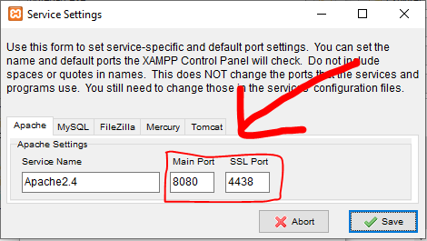

# Proyectro del cajón de herramientas.

Este proyecto ayuda a la correcta organización de herramienta.  
Este programa ayuda a mantener al tanto sobre la entrada y salida de las herramientas,
indicando que usuario sacó dicha herramienta y si la regresó o no.  
También, este cuanta con un sistema de administración de herramienta para agregar
nuevas herramientas o eliminar una.  

## Herramientas a utilizar:

Para poder instalar la base de datos y descargar este proyecto se deberán de instalar
los siguientes programas y deberás cumplir las siguientes características en tu 
computadora.

### Programas:
- La ultima version de XAMPP, la cual la puedes descargar aquí -> 
[Descargar XAMPP](https://www.apachefriends.org/es/index.html).
- Visual Studio Code o cualquier editor de textos. Esto es para que puedas modificar el 
código o simplemente visualizarlo. [Descarga VSCode aquí](https://code.visualstudio.com).
- Git. Este programa es importante para poder descargar este proyecto. 
[Descarga aquí Git](https://git-scm.com/).
- FireFox o Google Chrome. (Te explico el porqué la importacia de FireFox más adelante).

### Características importantes:
- Windows 7 x64 o superior.
- Mínimo 3 Gb de memoria RAM (Esto para que no colapse el servidor APACHE y la base de 
datos MySQL).
- Procesador de 2 núcleos o más a 1.2GHz mínimo.
- Disco duro de 50GB mínimo (Esto es para la instalación de XAMPP, VSCode, un navegador 
WEB y un SO, al igual que será para el almacenamiento de la base de datos).
- Es sumamente importante que el navegador WEB sea FireFox, ya que este navegador tiene 
una compatibilidad mas alta a los scripts para los eventos. Si bien, Google Chrome también 
soporta los scripts, es menos compatible con algunos eventos y consume más memoria de la 
necesaria. También puedes utilizar otro navegador, solo que tienes que sersiorarte de este 
punto.
- Es importante no tener ningún programa instalado que ocupe el puerto 80 y el 3306 
(normalmente son programas que utilizan el internet para poder funcionar, tales como 
Spotify, WhatsApp Desktop, Steam o algún programa de streaming). (Para solucionar 
problemas con los puertos, ve a la sección de solución de problemas en este mismo 
documento.

## Como descargar y ejecutar este proyecto.
Para descargar este proyecto necesitas tener previamente instalado el programa de Git y 
XAMPP (dichos en los programas necesarios) y deberas hacer lo siguiente:
1. Presionas la teclas Windows + R.
2. Escribes CMD en la ventana que salió.
3. Dentro del CMD escribes `cd Desktop` y presionas intro.
4. Volvemos a escribir `git clone https://github.com/HectrollXD/Herramientas.git` y 
presionamos intro.
5. Una vez se descargue la carpeta la moveremos a la ruta `C:\xampp\htdocs\`.
6. Abriremos la aplicación de XAMPP y encendemos las opciones de MySQL y Apache.
7. Abrimos nuestro navgador y escribimos en el buscador `localhost/Herramientas/`.
8. ¡Listo! tenemos el programa corriendo.

## Solución de problemas.

### Solución del problema de los puertos 80 y 3306.
Captura del panel de control de XAMPP con el puerto 80 ocupado.  

* Por aplicaciones que están utilizando los puertos.  
Suele pasar que tenemos instalado algún software para escuchar música como Spotify, esto 
hace que se ocupe el puerto 80 de nuestro firewall y no nos deje utilizar nuestro 
computador como servidor WEB.  
Para solucionar esto, tenemos que identificar el programa que esté generando el problema y 
desinstalarlo.
Si el progrma que está utilizando el puerto 80 en necesario y no puedes desinstalarlo, 
tienes la
opción de cambiar el puerto manualmente en el panel de control de XAMPP.  
* Como cambiar el puerto de XAMPP:
  1. Abre el panel de control de XAMPP como administrador.
  2. Búsca la opción de "Config" y haz click en ella.  
  
  4. Una vez dentro, busca la opción de "Service and Port Settings" y haz click ahí.
  
  5. En la pestaña de "Apache" cambiaremos los valores de "Main Port" y "SSL Port".
  
  6. Tenemos que colocar en "Main Port" el valor de 8080 y el valor de "SSL Port" por 4438.
  
  7. Guardaremos los cambios.
  8. Despúes, nos iremos a la opción de "Config" y le damos click ahí.
  
  9. Le damos a la opcion de "Apache (httpd.conf)" y cambiaremos todos los valores de 80 a 
  8080 (son solo 2 los que debes de cambiar "Listen 80" y "ServerName localhost:80").
  10. Guardaremos los cambios y haremos los mismos pasos del paso 7 y nos meteremos a la 
  opción de "Apache (httpd-ssl.conf)" y cambiaremos los valores de 443 a 4438 (Solo donde 
  dice "Listen 433", "VirtualHost _default _:443" y "ServerName www.example.com:443").
  11. Guardamos los cambios y encendemos Apache.
  12. Abrimos nuestro navegador y escribimos "localhost:8080" y nos deberá de funcionar.
* Puerto 3306 ocupado.  
Este suele ser el error menos común al menos que se tenga una base de datos instalada, 
tales como Oracle o algun servicio de bases de datos (Servicio, el gestor es distinto).  
Para solucionar este problema debemos de hacer prácticamente lo mismo que como hicimos 
para solucionar el error del puerto 80, solo que en vez del servicio de Apache será en el 
servicio de MySQL, y cambiaremos el puerto de 3306 a 3307, y modificar los archivos .conf 
para pasar los parametros de 3306 a 3307.  
Lo idóneo es que desinstales la base de datos o la aplicación que esté generando este 
conflicto.

### Solución del problema de la instalación de XAMPP.

* Por sistema operativo.  
A veces el programa de XAMPP suele dar errores ante la instalación, esto suele ser 
normalmente por el tipo de arquitectura del sistema operativo, ya que XAMPP solo está 
compilado para la versión de 64 bits y no la de 32 bits. Para solucionar esto, investiga 
si tu procesador soporta instrucciones de 64 bits (Lo puedes ver en la documentación 
oficial de la marca de tu procesador) e instalar nuevamente el sistema operativo pero el 
de 64 bits (si no lo soporta no lo instales, hay más opciones como WAMPP o instala el 
sistema operativo Ubuntu desktop 20.04LTS).  
Ejemplo de si el procesador soporta instrucciones de 64 bits (Nota donde dice Intel 64 y 
conjunto de instrucciones):  

* Simple error.  
Para este caso (poco común) sersiorate que no halla sido instalado anteriormente. Si ese 
es el caso, desinstala XAMPP desde el panel de control y elimina todas las carpetas 
relacionadas a XAMPP.  
Si es primera ves que se instala y dio error, sersiorate que tu windows esté actualizado 
con todos sus parches de seguridad y no falte algún archivo .dll en el sistema. Si es por 
el archivo .dll, descargalo e instalalo en el sistema operativo. Si no, búsca las 
actualizaciones de Windows en Windows Update.

### Solución del problema a la conexión de la base de datos.

* Primero sersiorate que la opcion de MySQL esté activada en el panel de control de XAMPP. 
En dado caso que si esté encendido y te de error al conectar a la base de datos, necsitarás 
hacerlo manualmente. Para ello abrirás un navegador WEB y buscarás `localhost/phpmyadmin/` y ejecutarás el archivo de la base de datos localizada en la carpeta "SQL" (solo la creación de la base de datos y las tablas).

### Sistema operativo no compatible.
Para ello, sería mejor que pidas prestada una computadora que soporte las aplicaciones que 
necesitas, si no tienes a nadie que lo haga, puedes obtar por instalar Ubuntu 20.04LTS e 
instala la pila de LAMP (hay tutoriales en YouTube o en Google), ya que, linux es más 
compatible en lo que a servidores refiere.  
Si no encuentras tutoriales de como instalar la pila de LAMP, te dejo un link que te 
explica de manera eficiente el como hacerlo. 
[Video de instalación de la pila LAMP](https://youtu.be/7P9rdBQJnMU)